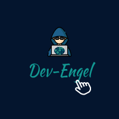

# Hola Mi Nombre Es Angel

## Desarrollador Python

 - [Awesome Readme Templates](https://awesomeopensource.com/project/elangosundar/awesome-README-templates)
 - [Awesome README](https://github.com/matiassingers/awesome-readme)
 - [How to write a Good readme](https://bulldogjob.com/news/449-how-to-write-a-good-readme-for-your-github-project)

